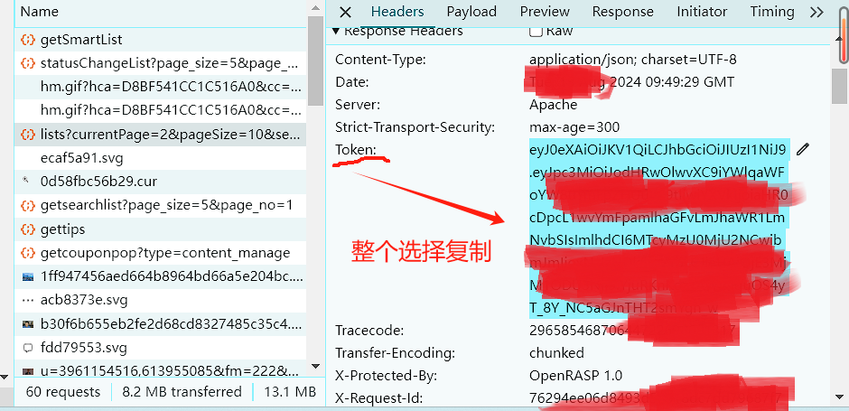
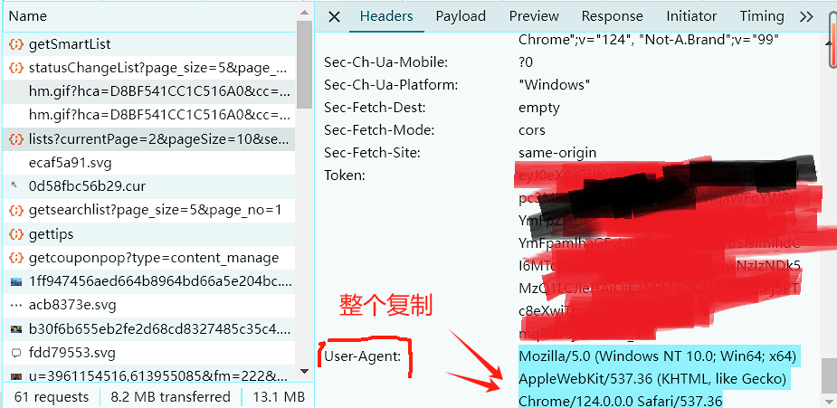

# BatchWithdrawAndDeleteBaiduArticle
批量撤回和删除百家号的文章

用python编写脚本并运行。效果如下


## 先获取文章统计数据的Python代码
```python
import requests
import json
import time
import random
import pandas as pd


headers = {
    'Cookie': '填写你的Cookie，详见文章末尾的备注',
    'token': '填写你的token，详见文章末尾的备注',
    'User-Agent': '填写你的User-Agent，详见文章末尾的备注'
}

content_data = []


def get_data(current_page):
    url = "https://baijiahao.baidu.com/pcui/article/lists"
    params = {
        "currentPage": current_page,
        "pageSize": 10,
        "search": "",
        "type": "",
        "collection": "",
        "dynamic": 1
    }

    response = requests.get(url, params=params, headers=headers)
    data = response.json()

    return data.get("data", {}).get("list", []), data.get("data", {}).get("page", {})

def save_data_to_json(data):
    for article in data:
        article_id = article.get("article_id")
        title = article.get("title")
        read_amount = article.get("read_amount")
        rec_amount = article.get("rec_amount")
        can_withdraw = article.get("withdraw_status", {}).get("can_withdraw")

        content_data.append({
            "article_id": article_id,
            "title": title,
            "read_amount": read_amount,
            "rec_amount": rec_amount,
            "can_withdraw": can_withdraw
        })
            
# 将json数据转换为DataFrame
def json_to_dataframe(json_data):
    df = pd.DataFrame(json_data)
    return df
# 保存到Excel文件
def save_to_excel(dataframe, output_file):
    dataframe.to_excel(output_file, index=False)

def main():
    current_page = 1
    total_page = 24 # 这里写你自己百家号后台文章的页数，替换这个24

    while current_page <= total_page:
        print(f"开始查询第{current_page}页数据")
        data, page_info = get_data(current_page)
        save_data_to_json(data)
        current_page += 1
        time.sleep(random.uniform(1, 2))

    with open("content.json", "w", encoding="utf-8") as json_file:
        json.dump(content_data, json_file, ensure_ascii=False, indent=4)
    # 替换成你想要保存的Excel文件路径
    excel_output_file = 'content.xlsx'
    result_df = json_to_dataframe(content_data)
    # 保存到Excel文件
    save_to_excel(result_df, excel_output_file)

    print(f"数据已成功保存到 {excel_output_file}")


if __name__ == "__main__":
    main()

```
## 根据需要进行批量撤回和批量删除对应文章的Python代码
```python

import requests
import json
import time
import random

headers = {
    'Cookie': '填写你的Cookie，详见文章末尾的备注',
    'token': '填写你的token，详见文章末尾的备注',
    'User-Agent': '填写你的User-Agent，详见文章末尾的备注',
}

def process_article(article):
    article_id = article["article_id"]
    title = article["title"]
    can_withdraw = article["can_withdraw"]
    read_amount = article["read_amount"]
    rec_amount = article["rec_amount"]

    
    print(f"当前文章id {article_id} ，能否撤回：{can_withdraw},推荐量：{rec_amount},阅读量：{read_amount}开始处理")
    if can_withdraw == -1:
        print("调用接口删除文章")
        # 调用接口删除文章
        url = 'https://baijiahao.baidu.com/pcui/article/remove'
        params = {'article_id': article_id}

        response = requests.post(url, headers=headers, data=params)
        print(response)
        result = json.loads(response.text)

        if result["errmsg"] == "success":
            print(f"文章 {title} 删除成功")
        else:
            print(f"文章 {title} 删除失败")

    elif can_withdraw == 1 and read_amount < 1000 and rec_amount < 10000:
	# 可以自行定义上面要撤回的文章的条件，这里是can_withdraw == 1并且阅读量小于1000并且推荐量小于10000
        print("调用接口撤回文章")
        # 调用接口撤回文章
        url = 'https://baijiahao.baidu.com/pcui/article/withdraw'
        params = {'article_id': article_id}

        response = requests.post(url, headers=headers, data=params)
        print(response)
        result = json.loads(response.text)

        if result["errmsg"] == "success":
            print(f"文章 {title} 撤回成功")
        else:
            print(f"文章 {title} 撤回失败")
    else:
        print("暂时不处理")

if __name__ == "__main__":
    # 之前提取的文章数据，包含文章id,推荐量、阅读量、能否撤回等
    json_file_path = 'content.json'

    with open(json_file_path, 'r', encoding='utf-8') as file:
        data = json.load(file)
    # 过滤出 can_withdraw 等于 -1 的文章
    filtered_data = [article for article in data if article["can_withdraw"] == -1]
    # 按照 rec_amount 由小到大排序
    # data.sort(key=lambda x: x["rec_amount"])
    print(f"总共有 {len(filtered_data)} 篇文章需要删除")
    #print(f"总共有 {len(data)} 篇文章需要处理，优先处理推荐量少的")
    #for article in data:
    for article in filtered_data:
        process_article(article)
        time.sleep(random.uniform(2, 4))  # 随机停顿2到4秒

```
## 备注
**Cookie获取**


**Token获取**



**User-Agent获取**



**页数获取**


